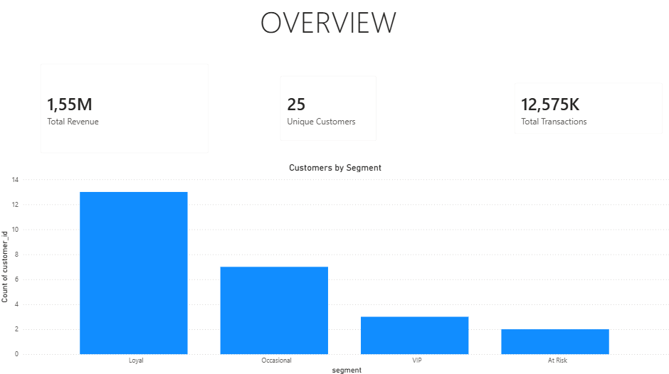
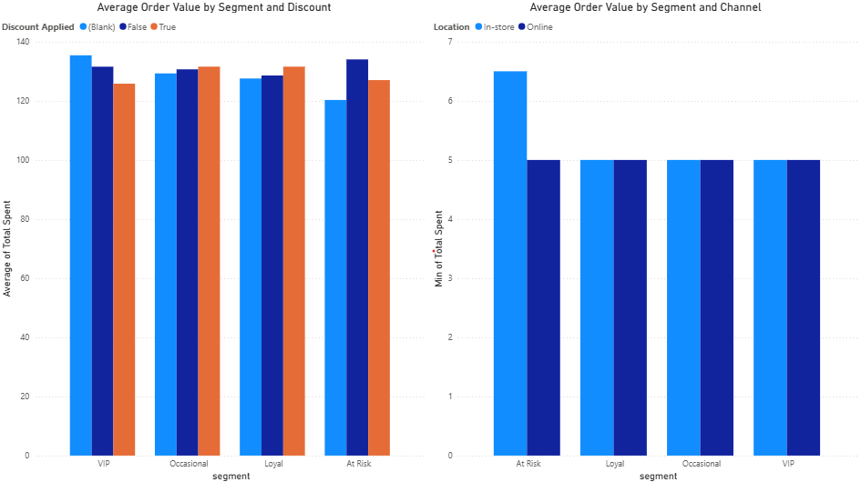

# CRM Campaign Analysis & Customer Segmentation

## 📋 Project Overview
This project simulates the work of a CRM Analyst: segmenting customers based on purchase behavior and evaluating the effectiveness of promotional campaigns across customer segments and sales channels.

## 🎯 Business Questions
- How can customers be segmented based on their purchase behavior?
- Do promotions increase average order value, and does this vary by segment?
- Does the online vs. in-store channel affect spending by segment?

## 🗂️ Dataset
Source: Kaggle - Retail Store Sales: Dirty for Data Cleaning (https://www.kaggle.com/datasets/ahmedmohamed2003/retail-store-sales-dirty-for-data-cleaning)
- 12,575 transactions | 25 unique customers | Jan 2022 – Jan 2025

## 🔍 Process
1. **Data quality check** — verified duplicates, nulls, date ranges
2. **RFM Segmentation** — calculated Recency, Frequency, Monetary scores 
   using window functions (NTILE), classified customers into VIP / Loyal / 
   Occasional / At Risk segments
3. **Promotion effectiveness analysis** — compared average order value with/without discount, by segment
4. **Channel analysis** — compared average order value online vs in-store, by segment
5. **Power BI dashboard** — built a 2-page interactive report connected directly to BigQuery

## 💡 Key Insights
- VIP and At Risk customers spend **less** with promotions applied - suggesting discounts may not be the right incentive for these segments.
- VIP and At Risk customers spend **more online** than in-store (+3.8% and +8.0% avg order value) - digital channels may be more effective for retaining high-value and at-risk customers.

  ## 📊 Dashboard

## 📁 Files
- `queries.sql` — all SQL queries (data cleaning, RFM segmentation, analysis)
- `crm_dashboard.pbix` — Power BI dashboard file
- `screenshots/` — query results and dashboard views
